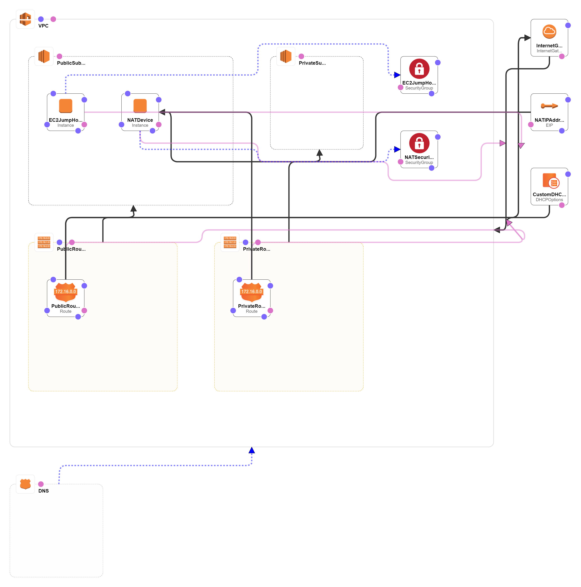
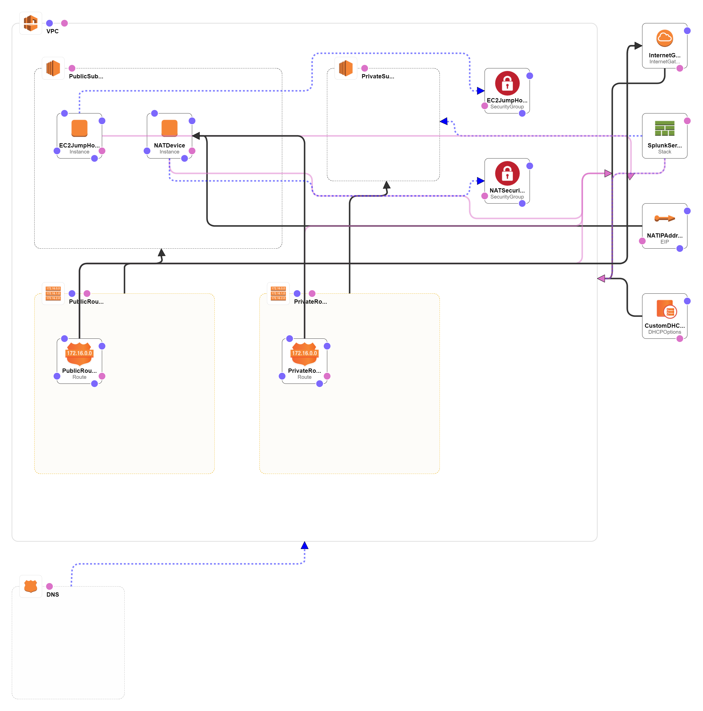

# Deploying a pair of public and private subnets with a NAT instance and a Splunk Enterprise instance within a VPC 


## Overview

The templates create the following infrastructure.

### VPC with NAT instance, 2 subnets, a jumphost (bastion host), and a private hosted DNS name.
[](https://console.aws.amazon.com/cloudformation/home?region=ap-southeast-2#/stacks/new?stackName=SplunkEnterprisePrivate&templateURL=https://cybersociety.s3.amazonaws.com/cf-templates/vpn-nat-jumphost.template)


### VPC with NAT instance, 2 subnets, a jumphost (bastion host), a private hosted DNS name, and a Splunk Enterprise instance.
[](https://console.aws.amazon.com/cloudformation/home?region=ap-southeast-2#/stacks/new?stackName=SplunkEnterprisePrivate&templateURL=https://cybersociety.s3.amazonaws.com/cf-templates/master_infrastructure.template)  



### Infrastructure-as-Code to maintain idempotency

A template can be used repeatedly to create identical copies of the same stack (or to use as a foundation to start a new stack).  Templates JSON-formatted text files . With CloudFormation, you can see exactly which AWS resources make up a stack. You retain full control and have the ability to modify any of the AWS resources created as part of a stack. 


### Template details

The templates below are included in this repository (cloudform)

| Template | Description |
| --- | --- | 
| [master_infrastructure.template](master_infrastructure.template) | This is the master template - deploy it to CloudFormation and it will also launch another netsted stack to launch a Splunk Enterprise Instance. This template deploys a VPC with a pair of public and private subnets in an Availability Zone. It deploys an [Internet gateway](http://docs.aws.amazon.com/AmazonVPC/latest/UserGuide/VPC_Internet_Gateway.html), with a default route on the public subnets. It deploys a NAT instance, private hosted DNS name in AWS Route 53, a bastion host, and default routes for them in the private subnets|
| [splunk_server.template](splunk_server.template) | This template deploys a Splunk Enterprise instance launched by [master_infrastructure.template](master_infrastructure.template) with required [security groups](http://docs.aws.amazon.com/AmazonVPC/latest/UserGuide/VPC_SecurityGroups.html)|
| [vpc-nat-jumphost.template](vpc-nat-jumphost.template)| This template deploys a VPC with a pair of public and private subnets in an Availability Zone. It deploys an [Internet gateway](http://docs.aws.amazon.com/AmazonVPC/latest/UserGuide/VPC_Internet_Gateway.html), with a default route on the public subnets. It deploys a NAT instance, private hosted DNS name in AWS Route 53, a bastion host, and default routes for them in the private subnets without launching a Splunk Enterprise instance so this stack can be used to as the infrastructure stack for simple workloads.|

After the CloudFormation templates have been deployed, the [stack outputs](http://docs.aws.amazon.com/AWSCloudFormation/latest/UserGuide/outputs-section-structure.html) will list all required details to start to interact with bastion host, NAT instance, and Splunk Enterprise instance.


### Customize the templates

1. [Forking](https://github.com/hyperionian/cloudform#fork-destination-box) this GitHub repository.
2. Clone the forked GitHub repository to your local machine.
3. Modify the templates appropriately.
4. Upload the templates to an Amazon S3 bucket of your choice. If you launch the stack from this README, you will be launching the stack from current S3 bucket.
5. Either create a new CloudFormation stack by deploying the master_infrastructure template, or update your existing stack with your version of the templates.


By default, [Amazon Linux AMI](https://aws.amazon.com/amazon-linux-ami/) instances are used, but you can change this by modifying the following section:

```
...
"AWSRegionArch2AMI" : {
      "us-east-1"        : {"PV64" : "ami-2a69aa47", "HVM64" : "ami-6869aa05", "HVMG2" : "ami-2e5e9c43"},
      "us-west-2"        : {"PV64" : "ami-7f77b31f", "HVM64" : "ami-7172b611", "HVMG2" : "ami-83b770e3"},
      "us-west-1"        : {"PV64" : "ami-a2490dc2", "HVM64" : "ami-31490d51", "HVMG2" : "ami-fd76329d"},
      "eu-west-1"        : {"PV64" : "ami-4cdd453f", "HVM64" : "ami-f9dd458a", "HVMG2" : "ami-b9bd25ca"},
      "eu-central-1"     : {"PV64" : "ami-6527cf0a", "HVM64" : "ami-ea26ce85", "HVMG2" : "ami-7f04ec10"},
      "ap-northeast-1"   : {"PV64" : "ami-3e42b65f", "HVM64" : "ami-374db956", "HVMG2" : "ami-e0ee1981"},
      "ap-northeast-2"   : {"PV64" : "NOT_SUPPORTED", "HVM64" : "ami-2b408b45", "HVMG2" : "NOT_SUPPORTED"},
      "ap-southeast-1"   : {"PV64" : "ami-df9e4cbc", "HVM64" : "ami-a59b49c6", "HVMG2" : "ami-0cb5676f"},
      "ap-southeast-2"   : {"PV64" : "ami-63351d00", "HVM64" : "ami-dc361ebf", "HVMG2" : "ami-a71c34c4"},
      "ap-south-1"       : {"PV64" : "NOT_SUPPORTED", "HVM64" : "ami-ffbdd790", "HVMG2" : "ami-f5b2d89a"},
      "sa-east-1"        : {"PV64" : "ami-1ad34676", "HVM64" : "ami-6dd04501", "HVMG2" : "NOT_SUPPORTED"},
      "cn-north-1"       : {"PV64" : "ami-77559f1a", "HVM64" : "ami-8e6aa0e3", "HVMG2" : "NOT_SUPPORTED"}
    },
    ...
```


### Change the VPC or subnet IP ranges

This set of templates deploys the following network address design:

| Item | CIDR Range | Usable IPs | Description |
| --- | --- | --- | --- |
| VPC | 10.0.0.0/16 | 65,536 | The whole range used for the VPC and all subnets |
| Public Subnet | 10.0.0.0/24| ~4000 | The public subnet |
| Private Subnet | 10.0.1.0/24 | ~4000 | The private subnet |

You can adjust the CIDR ranges used in this section of the [master_template.template](master_infrastructure.template) template:

```
...
"Mappings" : {
    "SubnetConfig" : {
      "VPC"     : { "CIDR" : "10.0.0.0/16" },
      "Public"  : { "CIDR" : "10.0.0.0/24" },
      "Private" : { "CIDR" : "10.0.1.0/24"}
    },
...
```


### Contributing

See forking instruction.
